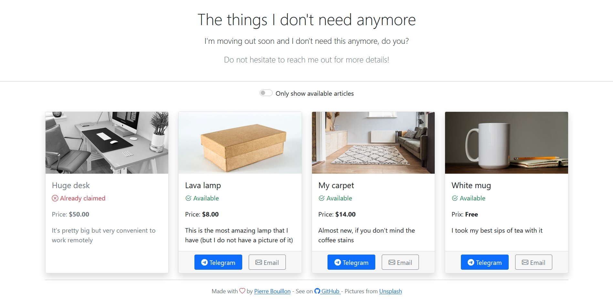

# Moving list

> Display what you don't want anymore and share the list with other !

## Setup

**This project does not relies on any backend or database** which means that you can host it on a GitHub page and everything will be functional

### Articles

To specify your articles, simply add records to the [`articles.json`](src/assets/articles.json) file and drop the associated image alongside it (if no image is provided, the image of a box will be used instead)

### Parameters

Some information are needed for the website such as your mail address or your telegram user name. All of those parameters may be changed in the [environment files](src/environments/)

## Deploying to GitHub Page

To deploy your version of `Moving list` follow theses steps:

- Fork the repository
- Populate its content with yours (as defined above)
- Run `deploy.sh` ou `deploy.ps1`, depending on your environment
- On GitHub, create a new page targeting your main branch and the `docs/` folder

Your site should now be up and running at `https://<your-username>.github.io/moving-list/`.

## Why

`Moving list` is a simple project, based on a personal experience:

When moving and packing everything, there is a lot of objects that we might don't need anymore such as some clothing, dishes, etc.

Instead of sending picture to everybody in several chats and repeating ourselves, why not displaying them somewhere and drop a link ?

That's how `Moving list` is born

## Troubleshooting

Since the website is fully hosted by GitHub on a GitHub page, the images are accessed from inside your repository.

Changing the visibility of the repository will add a token to your files and neither your images nor the `.json` will be reachable anymore, breaking the website.

If you don't want anyone to see your images or what you are selling, you may change the repository's visibility to private and host it with Heroku or another service (most of them do not charge anything when there is no backend)

> If you are changing the production environment, don't forget to change the `base` property in the [`environment.prod.ts`](src/environments/environment.prod.ts) file
